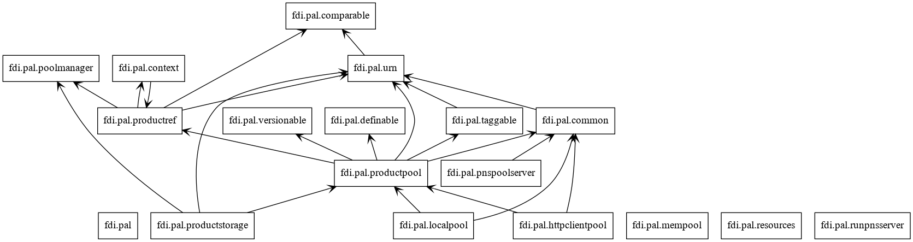
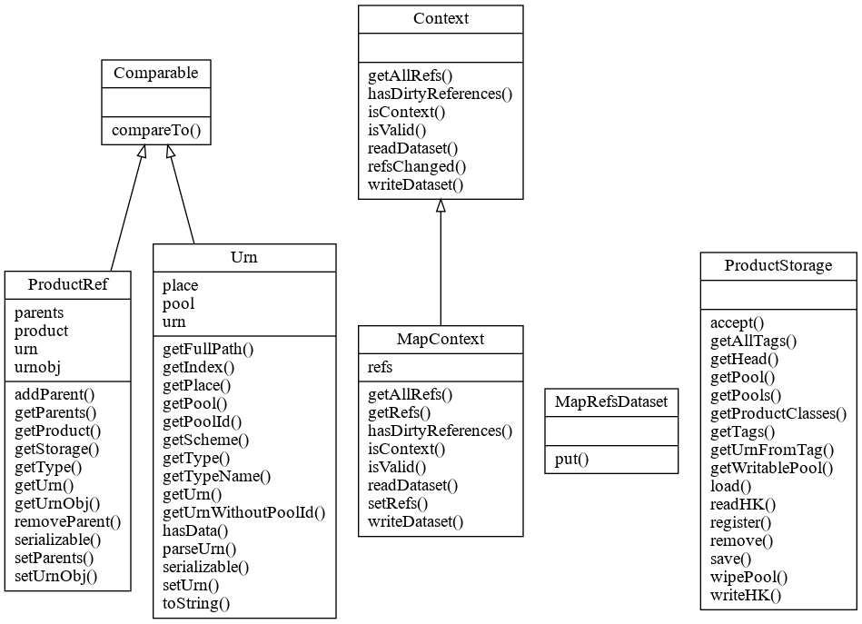

Product Access Layer allows data stored logical "pools" to be accessed with light weight product refernces by data processers, data storage, and data consumers. A data product can include a context built with references of relevant data. A ProductStorage interface is provided to handle saving/retrieving/querying data in registered pools.

_**Installation**_
for developers
```
cd /tmp
git clone ssh://git@mercury.bao.ac.cn:9005/mh/pal.git
cd pal
pip3 install -e .
```
for users
```
cd /tmp
git clone http://mercury.bao.ac.cn:9006/mh/pal.git
cd pal
pip3 install -e .
```

To run tests, in the same directory:
```
./test
```

_**Rationale**_

In a data processing pipeline or network of processing nodes, data products are generated within a context which may include input data, reference data, and auxiliary data of many kind. It is often needed to have relevant context recorded with a product. However the context could have a large size so including them as metadata of the product is often impractical.

Because once data are generated they can have a reference through which they can be accessed. The size of such references are typically less than a few hundred bytes, like a RUL. In the product context only data references are recorded.

This package provides MapContext, ProductRef, Urn, ProductStorage classes (simplified but mostly API-compatible with Herschel Common Science System v15.0) for the storing, retrieving, tagging, and context creating of data product modeled in the dataset package.

_**Definitions**_

**Urn**

The Universial Resource Name (URN) string has this format:
```urn:poolname:resourceclass:serialnumber
```
where
  *  resourceclass: fully qualified class name of the resource (product)
  *  poolname format: scheme + ```://``` + place + directory
  *  scheme format: ```file```, ```http``` ... etc
  *  place format: ```192.168.5.6:8080```, ```c:```, an empty string ... etc
  *  directory format: ```/``` + name + ```/``` + name ... ```/``` + name

**ProductRef**

This class not only holds the URN of the product it references to, but also record who (the _parents_) are keeping this reference.

**Context** and **MapContext**

Context is a Product that holds a set of ```productRef```s accessible by keys. The keys are strings for MapContext which usually maps names to product references.

**ProductStorage**

A centralized access place for saving/loading/querying/deleting data organized in conceptual pools. One gets a ProductRef when saving data.

_**Design**_

Packages



Classes



_**Examples**_

```
from pal.urn import Urn
from pal.productstorage import ProductStorage
from pal.productref import ProductRef
from pal.comparable import Comparable
from pal.context import Context, MapContext, MapRefsDataset
from pal.common import getProductObject

defaultpoolpath = '/tmp/pool'
defaultpool = 'file://' + defaultpoolpath
# create a prooduct
x = Product(description='in store')
# create a product store
pstore = ProductStorage()
# clean up possible garbage of previous runs
pstore.wipePool(defaultpool)
# save the product and get a reference
prodref = pstore.save(x)
# create an empty mapcontext
mc = MapContext()
# put the ref in the context.
# The manual has this syntax mc.refs.put('xprod', prodref)
# but I like this for doing the same thing:
mc['refs']['xprod'] = prodref
# get the urn
urn = prodref.urn
# re-create a product only using the urn
newp = getProductObject(urn)
# the new and the old one are equal
assert newp == x
```


For more examples see tests/test_all.py
