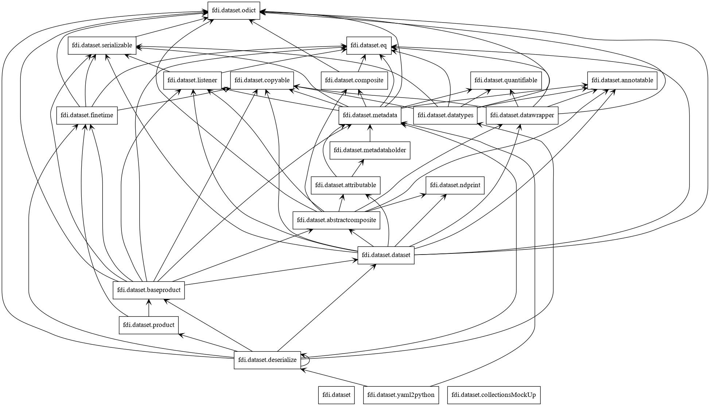
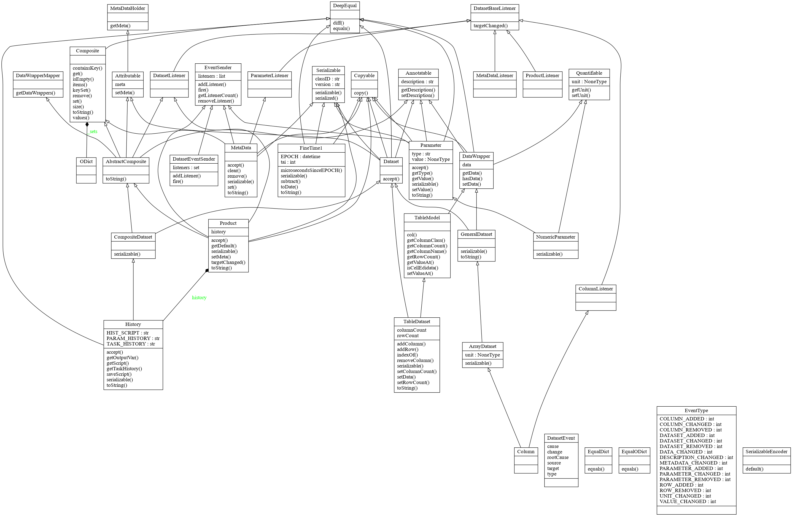

Dataset

This software is used to package data into self-describing Data Products and make them portable in human-friendly format between data processers, storage, and consumers.

_**Installation**_
for developers
```
cd /tmp
git clone ssh://git@mercury.bao.ac.cn:9005/mh/dataset.git
cd dataset
pip3 install -e .
```
for users
```
cd /tmp
git clone http://mercury.bao.ac.cn:9006/mh/dataset.git
cd dataset
pip3 install -e .
```

To run tests, in the same directory:
```
./test
```

_**Rationale**_

Generally 'products' means output results of a processing tasks to be shared by other tasks or users. 

People tend to store data with no meaning attached to them. Without attach meaning of the collection of numbers you have, it is difficult for other people to fully understand your data, it could be difficult for even you to recall the exact meaning of these numbers after a while.

This package implement a data product structure modeled after [Herschel Common Software System (v15)  products](https://www.cosmos.esa.int/web/herschel/data-products-overview), taking other  requirements of specific missions into account.


_**Definitions**_

**Product**

A product has
   * zero or more datasets: defining well described data entities (say images, tables, spectra etc...). 
   * history of this product: how was this data created, 
   * accompanying meta data -- required information such as who created this product, what does the data reflect (say instrument) and so on; possible additional meta data specific to that particular product type.

**Dataset**

Three types of datasets are implemented to store potentially any data as a dataset.
Like a product, all datasets may have meta data, with the distinction that the meta data of a dataset is related to that particular dataset only.
   * **array dataset**
   a dataset containing array data (say a data vector, array, cube etc...) and may have a unit. 
   * **table dataset**
   a dataset containing a collection of columns. Each column contains array data (say a data vector, array, cube etc...) and may have a unit. All columns have the same number of rows. Together they make up the table. 
   ** **composite dataset**
a dataset containing a collection of datasets. This allows arbitrary complex structures, as a child dataset within a composite dataset may be a composite dataset itself and so on...

**Meta Data** and **Parameters**

**Meta data**: data about data. Defined as a collection of parameters. 

**Parameter**: named scalar variables. 
This package provides the following parameter types: 
   * _Parameter_: Contains an arbitrary value and no unit
   * _NumericParameter_: Contains a number with possibly a unit
Apart from the value of a parameter you can ask it for its description and -if it is a numeric parameter- for its unit as well. 

**History**

The history is a lightweight mechanism to record the origin of this product or changes made to this product. Lightweight means, that the Product data itself does not  records changes, but external parties can attach additional information to the Product which reflects the changes.

The sole purpose of the history interface of a Product is to allow notably pipeline tasks (as defined by the pipeline framework) to record what they have done to generate and/or modify a Product. 

**Serializability**

In order to transfer data across the network between heterogeneous nodes data needs to be serializable.
JSON format is being considered to transfer serialized data for its wide adoption, availability of tools, ease to use with Python, and simplicity.

_**Design**_

Packages



Classes



_**Examples**_

**ArrayDataset**
```
from dataset.dataset import ArrayDataset

a1 = [1, 4.4, 5.4E3]      # a 1D array of data
a2 = 'ev'                 # unit
a3 = 'three energy vals'  # description
v = ArrayDataset(data=a1, unit=a2, description=a3)
v1 = ArrayDataset(a1, a2, description=a3)  # simpler but error-prone
>>> print(v)
ArrayDataset{ description = "three energy vals", data = "[1, 4.4, 5400.0]", unit = "ev"}
>>> print(v == v1)
True

>>> v.data = [34]
>>> v.unit = 'm'
>>> print('The diameter is %f %s.' % (v.data[0], v.unit))
The diameter is 34.000000 m.
```

**TableDataset**
```
from dataset.dataset import TableDataset

a1 = [dict(name='col1', unit='keV', column=[1, 4.4, 5.4E3]),
          dict(name='col2', unit='cnt', column=[0, 43.2, 2E3])
          ]
v = TableDataset(data=a1)
    
>>> v.getColumnName(0)
'col1'
>>> v.getValueAt(rowIndex=1, columnIndex=1)
43.2
>>> v.setValueAt(aValue=42, rowIndex=1, columnIndex=1)
>>> v.getValueAt(rowIndex=1, columnIndex=1)
42
```
**Metadata** and **parameter**
```
from dataset.metadata import Parameter, NumericParameter, MetaData

a1 = 'parameter_1'
a2 = Parameter(description='test param', value=534)
v = MetaData(description='my metadata')
v[a1] = a2
v['more'] = NumericParameter(description='another param', value=2.3, unit='sec')
>>> print(v)
MetaData[my metadata, parameter_1 = Parameter{ description = "test param", value = 534, type = int}, more = NumericParameter{ description = "another param", value = "2.3", unit = "sec", type = "float"}, ]
>>> print(v.description) 
my metadata
>>> print(v['more'])
NumericParameter{ description = "another param", value = "2.3", unit = "sec", type = "float"}
>>> v['parameter_1'].value
534

```

**Product**
```
from dataset.product import Product
from dataset.dataset import ArrayDataset, TableDataset

x = Product(description="This is my product example",  instrument="MyFavourite", modelName="Flight")
# ways to add datasets
i0 = 6
i1 = [[1, 2, 3], [4, 5, i0], [7, 8, 9]]
image = ArrayDataset(data=i1, unit='magV', description='image 1')
s1 = [dict(name='col1', unit='keV', column=[1, 4.4, 5.4E3]),
         dict(name='col2', unit='cnt', column=[0, 43.2, 2E3])]
spec = TableDataset(data=s1)
x["RawImage"] = image
>>> print( x.sets["RawImage"].data[1][2] )                  # should be i0
0
x.set('QualityImage', 'aQualityImage')   # diff syntax same function as above
x.sets["Spectrum"] = spec
>>> x["Spectrum"].getValueAt(columnIndex=1, rowIndex=0)   # should be 0
0
```

For more examples see tests/test_all.py
