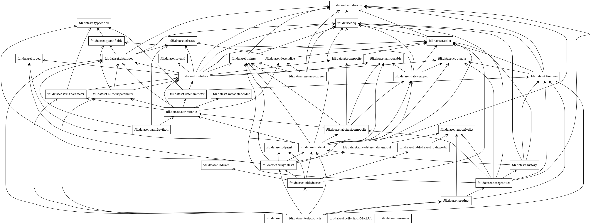
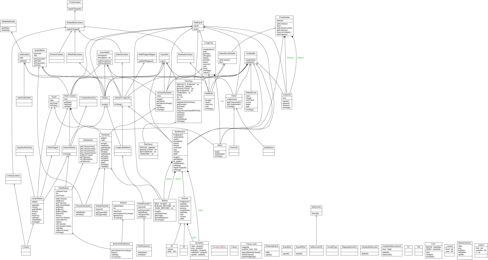
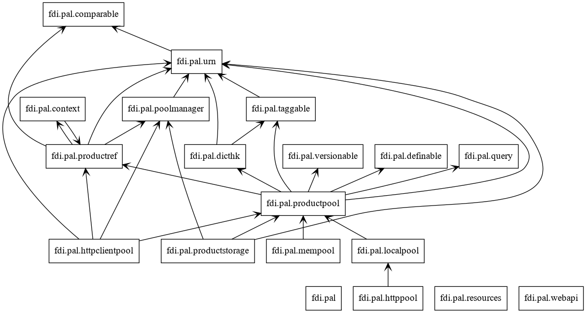
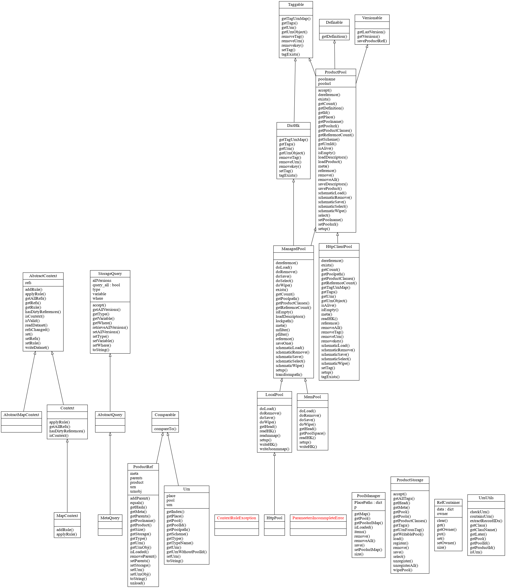
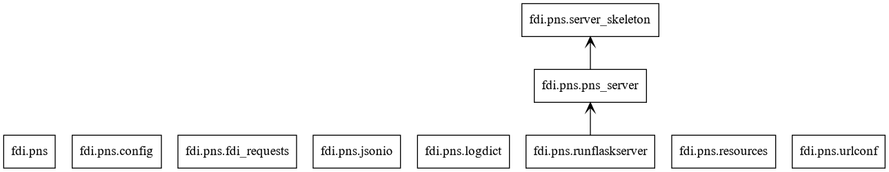
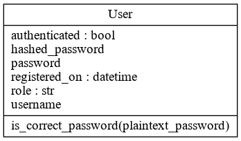

=============
API Reference
=============

.. toctree::
   :maxdepth: 1
   :caption: Contents:

   fdi/modules
   fdi/fdi.dataset
   fdi/fdi.pal
   fdi/fdi.pns
   fdi/fdi.httppool
   fdi/fdi.utils
   fdi/fdi.testsupport

Diagrams
========

packages_dataset.png

classes_dataset.png

packages_pal.png

classes_pal.png
	   

packages_pns.png
	   

classes_pns.png
	   

packages_utils.png
	   
.. image:: ../_static/packages_utils.png

classes_utils.png
	   
.. image:: ../_static/classes_utils.png

packages_common.png
	   
.. image:: ../_static/packages_common.png

classes_common.png
	   
.. image:: ../_static/classes_common.png

Indices and tables
==================

* :ref:`genindex`
* :ref:`modindex`
* :ref:`search`

